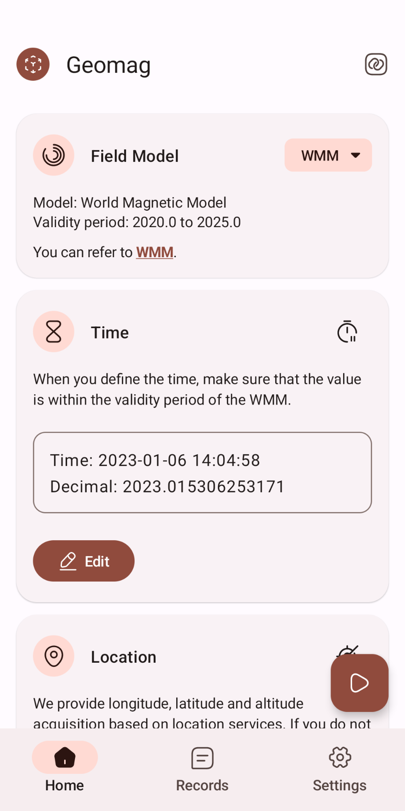
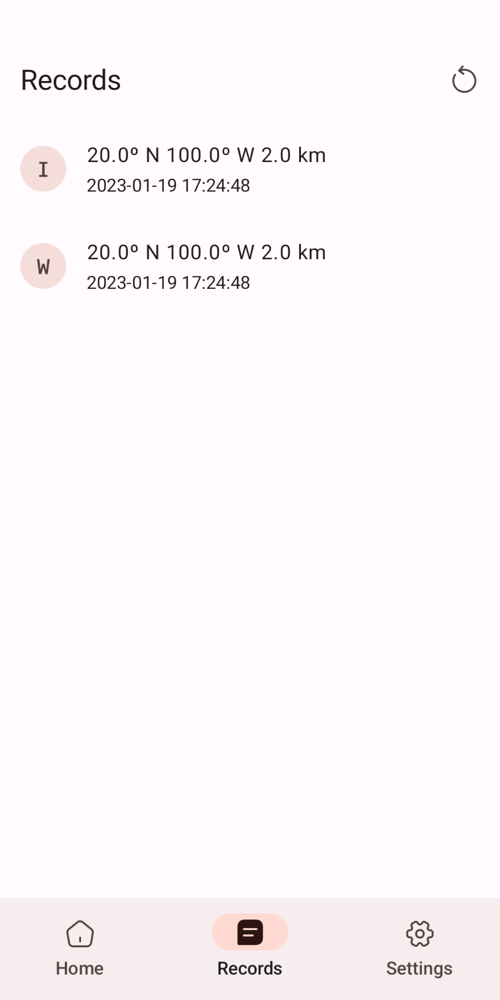
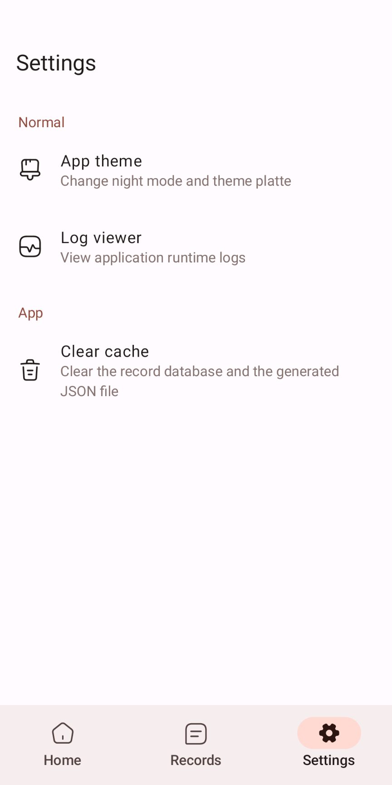
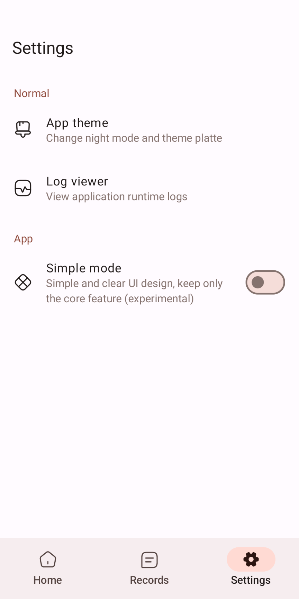
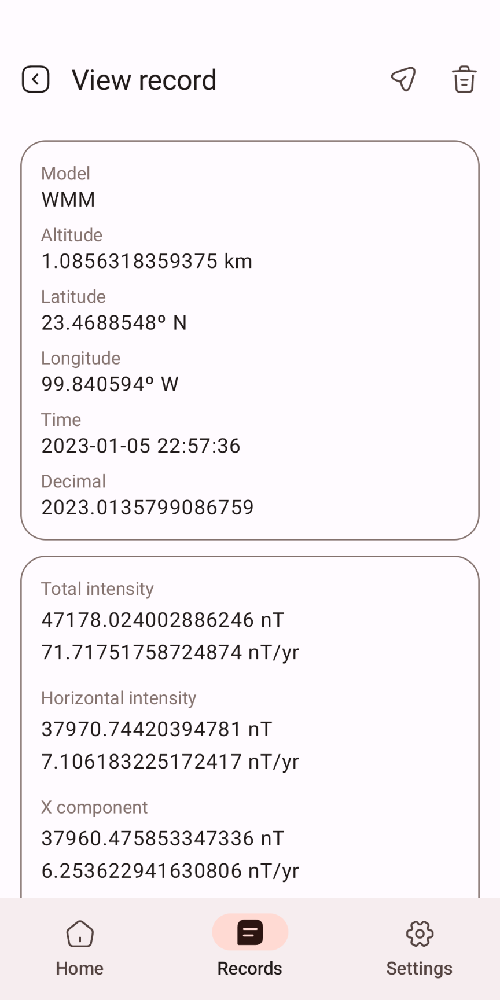
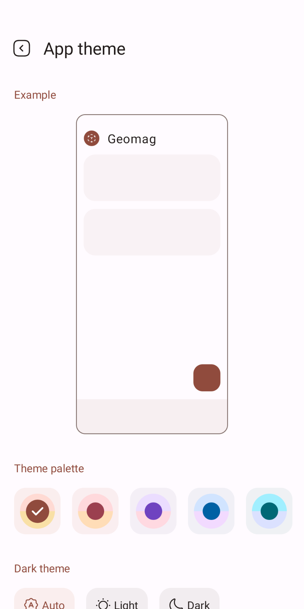

# Geomag
 

Geomag (short for `Geomagnetic`) is an Android app that calculates the geomagnetic field model.

Geomag is written with [Jetpack Compose](https://developer.android.com/jetpack/compose).

## Preview

  
  

## Supported Versions
Android 8.0 ~ 13

## Supported Models
 - IGRF (International Geomagnetic Reference Field)
 - WMM (World Magnetic Model)
 
 ## Credits
 - [proway2/go-igrf](https://github.com/proway2/go-igrf.git)
 - [westphae/geomag](https://github.com/westphae/geomag.git)

 ## License
 [MIT license](LICENSE)
